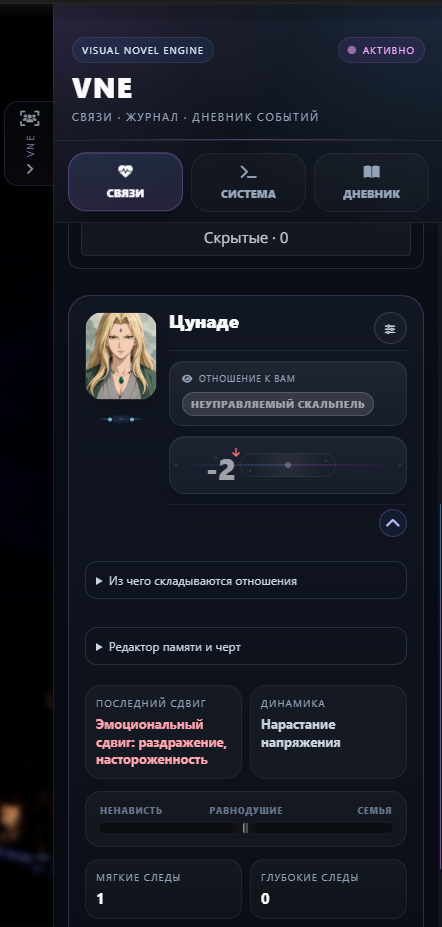

# 🎬 BB Visual Novel Engine

**Русский** · [English](README.en.md) · [История изменений](CHANGELOG.md) · [Портреты](docs/portraits.md)

Превратите ролевой чат в визуальную новеллу: выбирайте действия, следите за отношениями и сохраняйте важные моменты истории.

**3.2.2**

## ✨ Возможности

| Возможность | Что даёт |
| --- | --- |
| 🎬 **Действия VN** | Три варианта продолжения сцены с разным настроением и кратким прогнозом |
| 💞 **Отношения** | Отдельные шкалы доверия и романтики, история изменений и расшифровка баллов |
| 📖 **Память персонажей** | Воспоминания, постоянные черты характера и дневник событий |
| 👤 **Карточки персонажей** | Аватары, описания, поиск, сортировка и компактный вид |
| 🖼️ **Портреты и галерея** | Генерация с референсами, кадрирование, сохранение вариантов, скачивание и копирование |
| 💾 **Снимки состояния** | Экспорт и импорт отношений и памяти активной персоны |
| 🌐 **Два языка** | Русский и английский интерфейс с отдельным выбором языка новых ответов |

## 📦 Установка

1. В SillyTavern откройте **Расширения → Установить расширение**.
2. Вставьте адрес: `https://github.com/maxkara14/BB-Visual-Novel-Engine`.
3. Обновите страницу и откройте настройки **BB Visual Novel Engine**.
4. Выберите подключение для генерации и откройте чат.

После обновления при необходимости нажмите **Ctrl+F5**.

## 🎮 Как играть

После ответа персонажа нажмите **Действия VN** и выберите продолжение.

- **Автоотправка выключена:** реплика появляется в поле ввода — прочитайте, отредактируйте и отправьте её сами.
- **Автоотправка включена:** реплика отправляется сразу, без предпросмотра. Этот режим включён по умолчанию.

Кнопка **«Запрос»** позволяет направить следующую генерацию. Постоянные пожелания и длина ответа задаются в настройках. Можно выбрать объём истории для вариантов — от 1 до 100 сообщений.

Панель действий можно выключить, продолжая пользоваться отношениями и памятью. Маленькая кнопка **VN** рядом с полем ввода вернёт её обратно. Контекст Scene Director учитывается при его использовании.

## 💞 Отношения и персонажи

<table>
<tr>
<td width="42%" align="center" valign="top">

</td>
<td valign="top">
<h3>У каждого персонажа — своя история</h3>

<b>Отношения.</b> Доверие, романтика и последние изменения в одной карточке.

<b>Память.</b> Мягкие следы и глубокие события, которые можно просмотреть и отредактировать.

<b>Характер.</b> Описание, портрет и постоянные черты помогают сохранить образ персонажа.

<b>Навигация.</b> Поиск, компактный вид и список скрытых персонажей.

</td>
</tr>
</table>

В боковой панели доступны карточки персонажей, журнал и дневник. Раскройте карточку, чтобы увидеть воспоминания и понять, из чего складываются доверие и романтика.

Поиск, сортировка и компактный вид помогают ориентироваться в длинной истории. **«Скрытые · N»** открывает список персонажей, которых можно вернуть по одному или всех сразу. Скрытие не удаляет события: после возвращения отношения пересчитываются по сохранённой истории.

В редакторе можно изменить имя, аватар и описание. **«По шаблону»** собирает описание из доступных источников; общую инструкцию можно изменить в **«Язык и ответы → Промпт описания персонажа»**.

**Редактор памяти и черт** позволяет исправлять текст и скрывать записи с возможностью отмены. Это не меняет баллы отношений и исходные события.

## 🖼️ Портреты и галерея

<table>
<tr>
<th width="50%">Создайте образ</th>
<th width="50%">Сохраните любимые варианты</th>
</tr>
<tr>
<td valign="top"></td>
<td valign="top"></td>
</tr>
</table>

*Нажмите на любой снимок, чтобы открыть его в полном размере.*

Нажмите **«Портреты»** рядом с аватаром в редакторе персонажа.

**Создать:** напишите свой промпт или соберите внешность из описания и сцены. Добавьте общий стиль и до четырёх референсов внешности или стиля. Посмотрите результат, настройте кадр и сохраните карточку.

Если при сборке не хватает внешности, можно дополнить её с ИИ по контексту мира или отредактировать промпт вручную. Учитываются также персона и сеттинг.

**Галерея:** новые генерации сохраняются отдельно для чата, персоны и персонажа, даже если вы их не применили. Можно выбрать другой портрет, скачать оригинал или скопировать картинку.

Подключение изображений настраивается отдельно: **OpenAI Images, OpenAI Chat, Gemini или Naistera**. Есть список моделей и сохраняемые профили. Поддержка генерации и референсов зависит от выбранного сервиса и модели.

[Подробная инструкция по портретам →](docs/portraits.md)

## ⚙️ Подключение и языки

Для вариантов, описаний и черт характера выберите один источник:

| Источник | Как работает |
| --- | --- |
| **Текущее подключение SillyTavern** | Использует основную модель |
| **Профиль Connection Manager** | Использует сохранённый профиль, не переключая подключение чата |
| **Своё API** | Подключение по адресу, ключу и модели |

Формат ответа обычно достаточно оставить **Auto**. Если модель не поддерживает Schema, выберите **«Только инструкции»**. При обрезании ответа проверьте лимит токенов; для своего API он доступен в дополнительных настройках.

Язык интерфейса и язык новых ответов выбираются независимо. Сохранённые описания и воспоминания автоматически не переводятся. После смены языка интерфейса обновите страницу.

## 💾 Перенос истории

Экспорт сохраняет отношения, воспоминания, черты, описания и аватары активной персоны. Импорт **заменяет основу отношений**, а не складывает два набора. Сообщения чата остаются на месте.

**«Убрать импортированную основу»** возвращает основу до первого импорта и пересчитывает текущую историю чата. Это не откат сообщений.

Галерея портретов хранится отдельно: для её переноса нужны метаданные чата и файлы изображений SillyTavern. Удаление записи из галереи не удаляет файл на диске.

## 🔗 Автор

[BruniikBron: Lo-Fi & Mods](https://bblofi.online/) · [Telegram](https://t.me/Brun11kBr0n)
